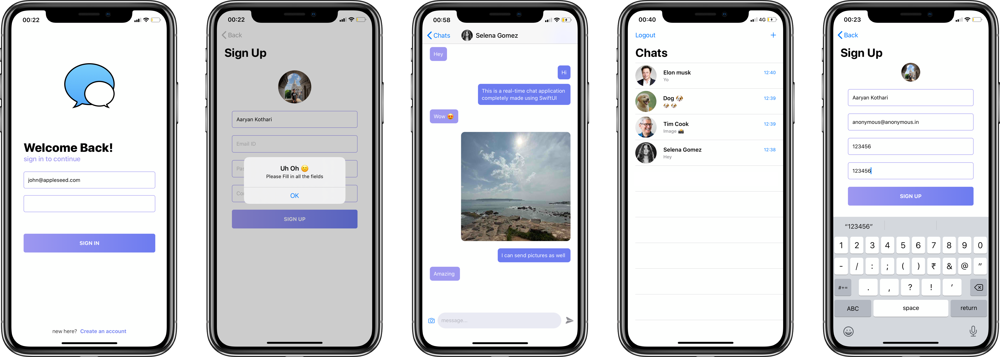

## Team Members
- Star
- Irene
- Matti
- Ken

## If Firebase not found, etc 
- Delete ${FILE_NAME}.xworkspace, podfile.lock, and 'Pods' folder
- go to terminal and cd to the folder and reinstall pods by inputting : "pod install" in the terminal
 

       
 

#### A realtime Chat Application made using SwiftUI.

## Overview 💬
- This app can be used for realtime one to one chatting
- data is stored in firebase database.
- Supports sharing of images as well.

## Screenshots 📷
 

  
 

 
 
 ## Installation 🛠
 - Clone / download this repository.
 - change the bundle identifier in project settings.
 - run the app.
 - <b> requires xcode 11.0 + <b>

 
## Includes ( ALL SWIFTUI )
- Combine Framework
- Firebase Auth + Database + Storage
- Custom Modifiers
- Animations
- Image picker 

